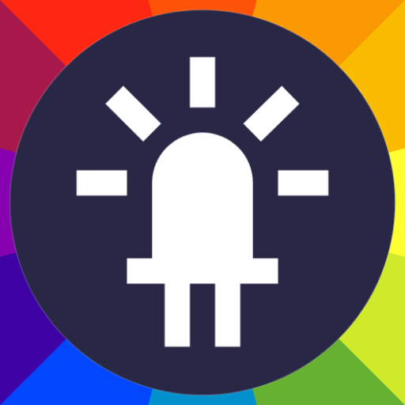

<h1 align="center">LED Strip RGB</h1>

  
  

Controlling WS8211 LED strip with ESP8266 and Android

---

## The project

This project was made for controlling a WS8211 LED string using an ESP8266 MCU.
And to control the MCU an Android app (It can also be controlled by a simple web interface at port 80)

The project currently is under development, the goal being to add more screenshots, better documentation, unit testing, async requests on the firmware and so on...

### ESP8266

The code is availbale inside the [ESP8266 source code directory](./ESP8266)

Features:
- Uses Rx pin to interface with the LED strip, so no need for pullup resistors at GP0 or GP2
- Makes usage of the wonderful [FastLED](http://fastled.io/) library
- Automatically syncs configurations with [Firebase](https://firebase.google.com/) and on restart restore the last state
- Exposes a REST API, of which allows control over:
  - color
  - effect
  - brightness
  - power
  - speed
- Web interface at port 80

  
- Remote debbuging via telnet
- OTA (Over The Air) firmware updates
- Configurable with define flags (On configuration.h, template to be released...)
- Multiple effects
  - Rainbow cycle
  - Rainbow 
  - Solid color
  - Knight rider
  - Sparkle
  - Pulse
  - Fire

---

### Android
 
Features:
- Architecture
  - Kotlin
  - View state
  - Live data (To be replaced by flow)
  - View model
  - MVVM
  - Koin
  - Material components
  - Navigation component
  - Android Workers
  - Android App Shortcuts
- Light and Dark theming

 

- Color picker

- [Custom slider button](./Android/app/src/main/kotlin/quevedo/soares/leandro/ledstriprgb/view/component/SliderButtonComponent.kt)
  - A custom view designed for me to this project, it's used on the Home screen for controlling Brightness and Speed values
  - Supports view outlines
  - Supports finger index
  - Handle saved and restored instances
  - Auto animate changes
  - Drawing made from scratch using Canvas API
  - Touch handling with drag and tap detection
  - Antialiased
  - Optmized for performance
  - Customizable by code and xml properties (Styles also supported)

